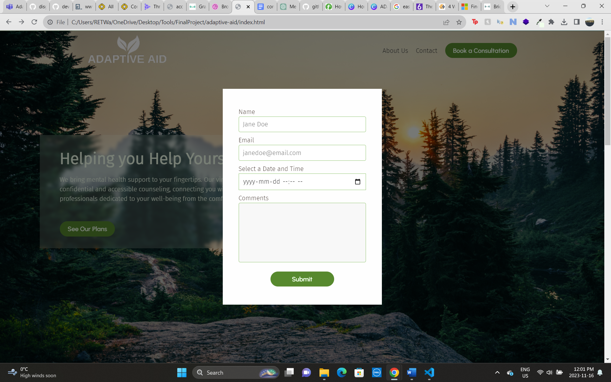
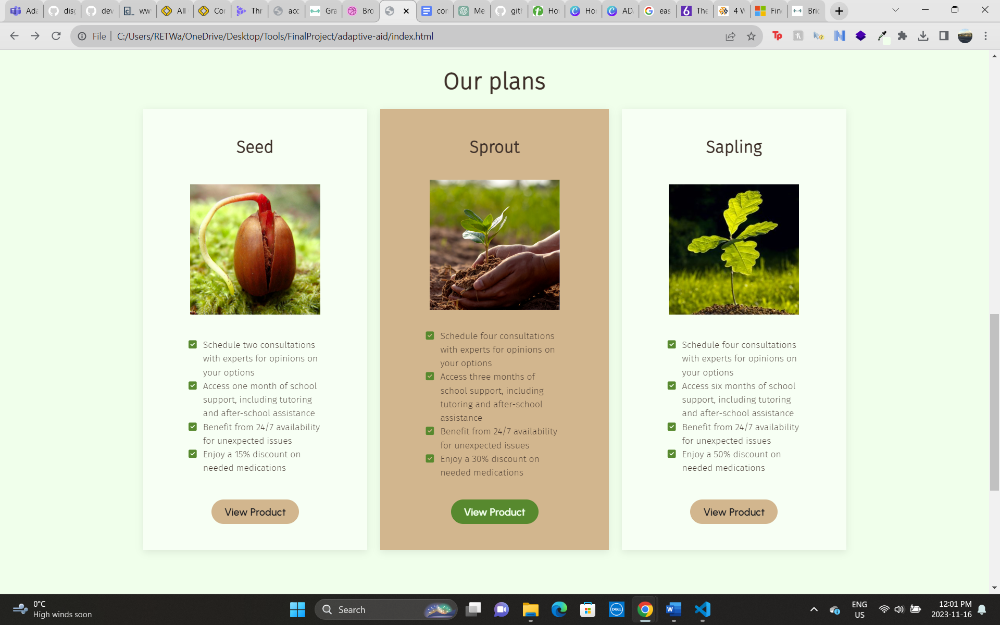

## Adaptive Aid

Adaptive Aid is a website offering services to those seeking assistance with mental health and/or disability.

This project was created to practice web development. We made use of our knowledge of 
HTML, CSS, JavaScript and Markdown.


### Challenges faced 
* conflict involving choice of class names
* learning about merge conflicts


### Future Features
* More product pages
* Create an About Us page
* Create a Contact Us page
* Complete form for booking consultations


### Modal Feature
We created a modal for our page and while it was a little challenging at first, the overall product and the way it enhanced our page made it worth it. See here an image of our modal. 

To achieve this we used the following JavaScript code.
```javascript
// Modal
select('#open-modal-btn').onclick = function() {
    select('#modal').style.display = 'flex';
    select('#modal').style.alignItems = 'center';
};
  
document.getElementsByClassName('close')[0].onclick = function() {
    select('#modal').style.display = 'none';
};

  // Close the modal if the overlay is clicked
  window.onclick = function(event) {
    if (event.target == select('#modal')) {
      select('#modal').style.display = 'none';
    }
  };
```

### Plans Automatic Scroll
To add some sophestication to our page we decied to add a button that when clicked will automatically send the user to a designated section of the page. See below a screenshot of the page. 

To do this we used JavaScript as seen below.
```javascript
// Click and scroll to section --- broken if utility functions are used
const plansSection = document.getElementById('plans');
const plansButton = document.getElementById('plans-btn');

 plansButton.addEventListener('click', () => {
    plansSection.scrollIntoView({
        behavior: 'auto',
        block: 'start',
        inline: 'nearest'
      });
  });
```


### Credits
[MC Guénette](https://github.com/mcguenette)
Team leader
Resolved merge conflicts
Header

[Dale Rupert](https://github.com/chaos1601)
Details page

[Robyn Waddell](https://github.com/robynwaddell)
Hero banner
Modal

[Alida Vermeer](https://github.com/alidaVermeer)
Footer
README


### [Demo](https://mcguenette.github.io/adaptive-aid/)